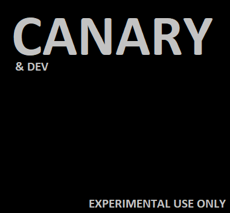

<link rel="stylesheet" href="../css/main.css?version=1.1">

Did you read the [**Terms and Conditions**](/T&C.html)?

For now, there are only MS Windows versions of the game. POSIX compability is coming soon. Don't try to use wine and/or other direct windows emulators because it won't work as intended since terminals differs.

In beta 0.2 will be for sure POSIX support since one of the main purposes is to have GNU/Linux servers.

[{:class="dlbox"}](./download_beta.html)
[{:class="dlbox"}](./download_full.html)
[{:class="dlbox"}](./download_experimental.html)
[{:class="dlbox"}](./download_canary_build.html)
